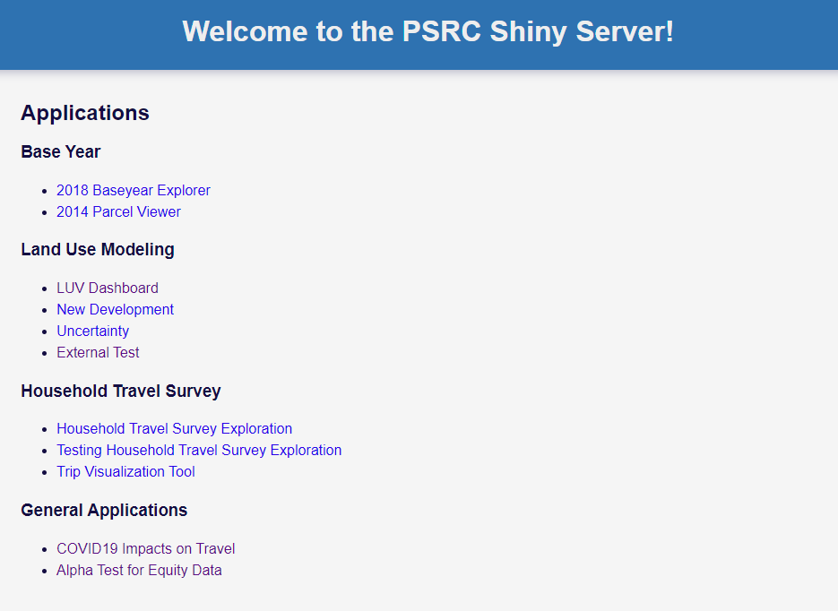

```{r setup, include=FALSE}
knitr::opts_chunk$set(echo = TRUE, eval = FALSE)
```

# PSRC Shiny Server

PSRC related apps can be hosted in-house on our very own Shiny server. Apps currently deployed from the PSRC Shiny server can be found here (VPN required): 

<aside>
The Shiny server lives on a linux server
</aside>

[http://aws-linux:3838/](http://aws-linux:3838/).

```{r echo=FALSE, eval = TRUE, out.width = '80%', fig.align='center'}

```


Before the Shiny server deploys your app:

1. Your app files must be on [**GitHub**](https://github.com/psrc). Ideally your app project should be in its own GitHub repo, e.g.:

    - https://github.com/psrc/baseyear2018explorer
    - https://github.com/psrc/travel-study-stories
  
2. Learn some Bash commands to access and navigate the linux server. Hana, Craig, or Christy can help setup your app in the server, but it's always good to know where your app lives and how to restart your app inside the Shiny server:

    - http://aws-linux/mediawiki/index.php/Shiny_Server


# Shinyapps.io

For personal, non-PSRC related projects, there is the option of [shinyapps.io](https://www.shinyapps.io/). RStudio can host your Shiny app. You can publish for free but there are limits to the number of apps that can be deployed, hours used, and resources.

After you first login, shinyapps.io provides instructions to deploy your first app. It will look similar to the code below: 

In the console of the RStudio IDE:

1. Have the `rsconnect` package installed and loaded.

```{r}
install.packages('rsconnect')
library(rsconnect)
```

2. Set the account information.

```{r}
setAccountInfo(name=' ',
               token=' ',
               secret=' ')
```

You can find your account information on the front page of your shinyapps.io account before your first app is published or under `Account > Tokens`


3. Deploy your app

```{r}
deployApp(account = 'your_account_name', 'path/to/your/app')
```

## Multiple Accounts

If you have more than one account with shinyapps.io:

- Include the `account` argument in `deployApp()`. 
- You may also have to tell the RStudio IDE which account to connect to in `Tools > Global Options > Publishing`[^1].

[^1]: https://stackoverflow.com/questions/26222052/have-more-than-one-shiny-accounts/26222254

## Other Notes

If you removed an app from your shinyapps.io account and are attempting to re-publish again, double check your local project folder and remove the rsconnect sub-folder if it exists. 

