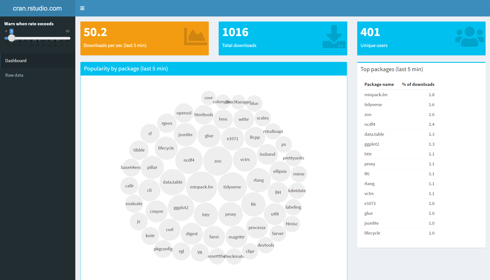
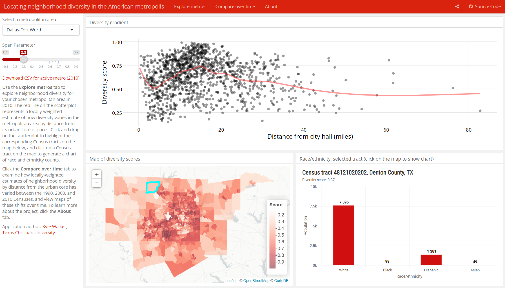

```{r setup, include=FALSE}
knitr::opts_chunk$set(echo = TRUE, eval = FALSE)
```

# The Shiny-verse

As you explore more of what Shiny has to offer, you may run across other packages that are a derivative of Shiny such as `Shinydashboard` and `Flexdashboard`, which may leave you wondering, what's the difference between Shiny and these off-shoot packages?

## Shiny 

Shiny, being the original package, has a lot of the infrastructure and pieces needed to create a customized app. Shiny can implement any layout and requires a server behind it to run R code.

## Shinydashboard

A common UI design among Shiny apps is the dashboard--a layout providing an at-a-glace view of information. [Shinydashboard](https://rstudio.github.io/shinydashboard/) was created to make it easier to create a dashboard that worked on top of Shiny.  

`Shinydashboard` also has unique widgets of its own that give it a more 'classic' dashboard look. It includes a variety of boxes (display, info, and value) to embed and comprises a header, sidebar, and body.

Since it requires Shiny, running a Shinydashboard will require a server.



## Flexdashboard

[Flexdashboard](https://rmarkdown.rstudio.com/flexdashboard/) is another package to easily create dashboards but there are a couple of things that set it apart from `shinydashboard`.

- It uses .Rmd files instead of .R files.
- It can be a static dashboard (standard web page) or
- a dynamic (interactive) document with Shiny and a server.

<aside>
If your dashboard is text-heavy, then Flexdashboard may be more helpful in that regard because it utilizes an RMarkdown file.
</aside>




