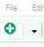
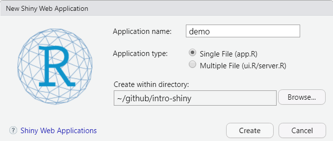
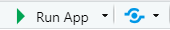
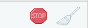

```{r setup, include=FALSE}
library(knitr)
library(here)
opts_chunk$set(echo = TRUE, eval = FALSE)
```

Getting an app started begins with just a `.R` file. There are some choices to make in the beginning: a single file app or a multi-page one. Aside from personal preference, it will depend on how you like to organize your code and how much code there will be. For this first part of the session, we will learn with a single file app.

# Templates

You can write from scratch or you can open a template to get a head start.

1. Click the drop down on the New File icon  and select `Shiny Web App`
2. The `Application Name` will be the name of the directory storing your app file.  
3. Select `Single File`  
4. Save it inside the `intro-shiny` project directory or another place.  

{width=80%}

# Run and Stop the app

## Viewer options

Before you hit `Run App` {width=20%} the drop down offers several options for viewing:

  - Run in Window (RStudio's pop-up browser)
  - Run in Viewer Pane
  - Run External (your default browser)

## Run and Stop

After clicking `Run App`, your app will be running locally and your R session is listening to the localhost. Your console will not respond.

Click on the stop sign icon {width=10%} to stop your app and resume your R session. Closing your browser window or RStudio's pop-up browser does not stop the app.


