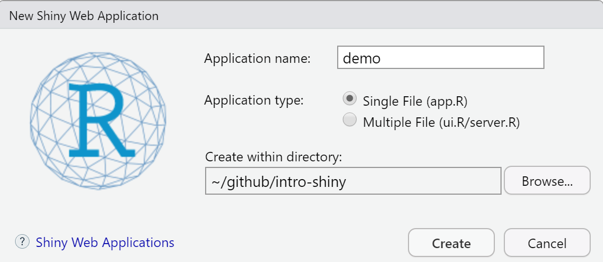

```{r setup, include=FALSE}
library(knitr)
library(here)
opts_chunk$set(echo = TRUE, eval = FALSE)
```

Getting an app started begins with just a `.R` file. There are some choices to make in the beginning: a single file app or a multi-page one. It will depend on how you like to organize your code, how much code there will be, and the number of collaborators on the app. For the first part of the session, we will learn with a single file app.

# Templates

You can write from scratch or you can open a template to get a head start.

1. Click the drop down on the New File icon  and select `Shiny Web App`
2. The `Application Name` will be the name of the new directory storing your app file.  
3. Select `Single File`  
4. Save it inside the root of your `intro-shiny` project directory or another place outside of `intro-shiny`.  

{width=80%}


# Operating the app

## Viewer options

Before you hit `Run App` {width=20%} the drop down offers several options for viewing:

  - Run in Window (RStudio's pop-up browser)
  - Run in Viewer Pane
  - Run External (your default browser)

## Run and Stop

After clicking `Run App`, your app will be running locally and your R session will be listening to the localhost. Your console will not respond.

Click on the stop sign icon {width=10%} to stop your app and resume your R session. If running externally, closing your default browser window does not stop the app.

# File Name

The file name when using a **single file app must be called `app.R` in order to deploy properly**. 

For teaching and learning purposes, the files provided for this module will use a different naming system to show app development at different stages. 


