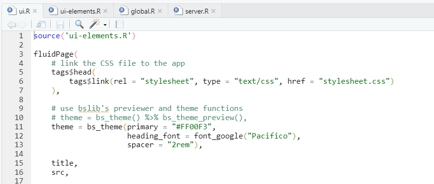

```{r setup, include=FALSE}
knitr::opts_chunk$set(echo = TRUE, eval = FALSE)
```

Open the files inside `intro-shiny/babynames/06-multi-file`

Single file apps have their benefits. If code length is minimal, then an `app.R` file is more than sufficient. However, content in a web app is more than likely to grow. An app using multiple files can help with code organization and readability. It can also make it easier to collaborate with others.

There are variations to how multiple file apps are set up, but at the very least within your project folder you'll have two files:

- ui.R
- server.R
- global.R (optional)

The `global.R` file is optional. The advantage of including it is to provide a clear central area to call packages and set global variables. 

# Sourcing Files

There's no limit to how many files you can use for your app. Use `source()` to read in another R file.

```{r echo=FALSE, eval = TRUE, out.width = '100%', fig.align='center'}

```

# Debugging

When debugging a multiple file app, use `browser()` instead of the standard way of setting the breakpoint. 

1. Set `browser()` inside a reactive context.
2. Run the app. 
3. In the example below, `browser()` is within an eventReactive(). Click on the 'go' button when the UI is available to activate the debugger. 

Code up to `browser()` will execute. Objects (e.g. `df_sub`) be available in the Environment pane of the IDE.

```{r}
# Server

 # change reactive to an eventReactive. Delay reaction until action button is clicked
    # allow filtering of multiple states
    filtered_df <- eventReactive(input$go, {
        df_sub <- df[name %chin% input$name & state %chin% input$state]
        
        browser()
        
        print(df_sub)
    })
```

Because reactives are lazy and need to be called on to operate, be sure that the reactive context that `browser()` is in is called somewhere downstream (e.g. `render*()`).

```{r}
# Server

  filtered_df <- eventReactive(input$go, {
      df_sub <- df[name %chin% input$name & state %chin% input$state]
      
      browser()
      
      print(df_sub)
  })

  output$main_table <- renderDT({
    
    filtered_df()
    .
    .
    .
  })

```


