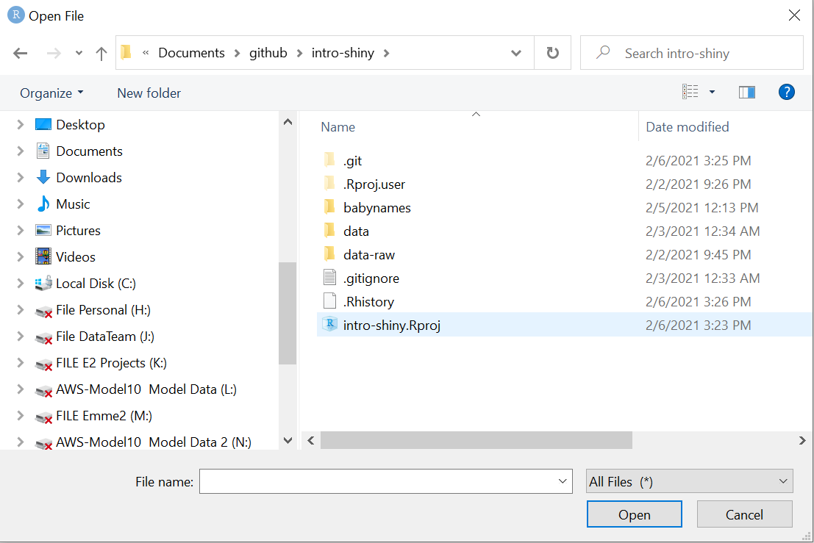
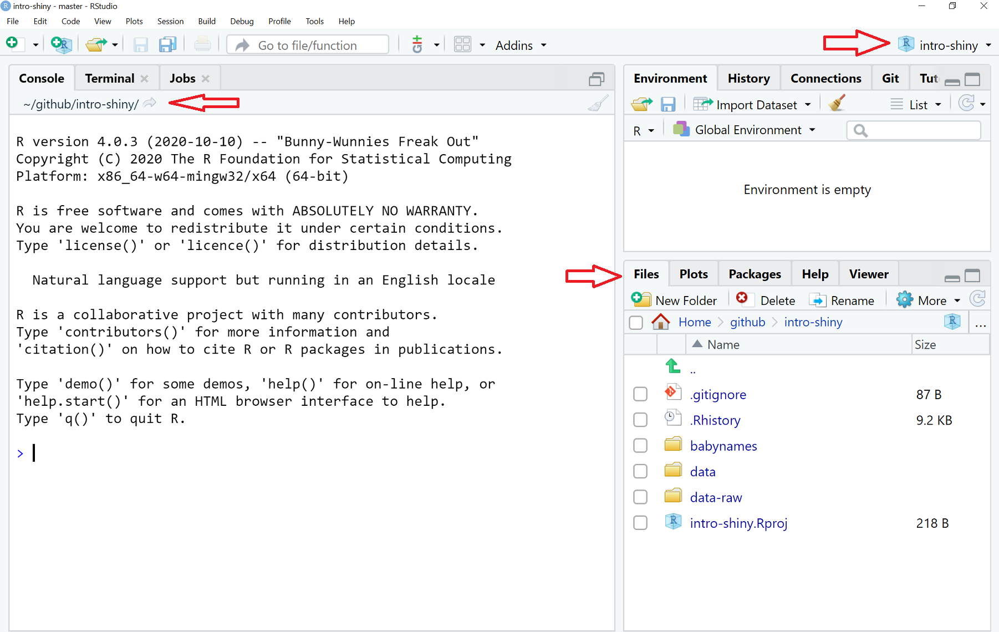
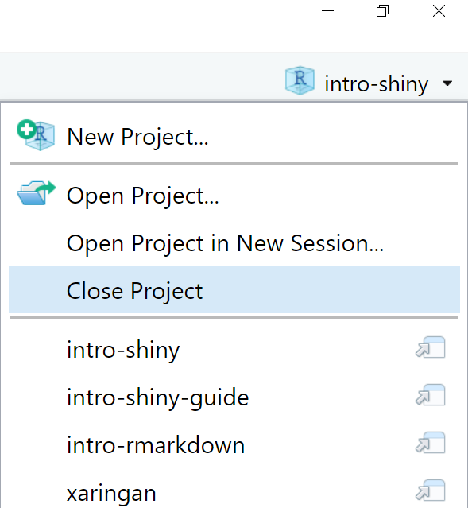
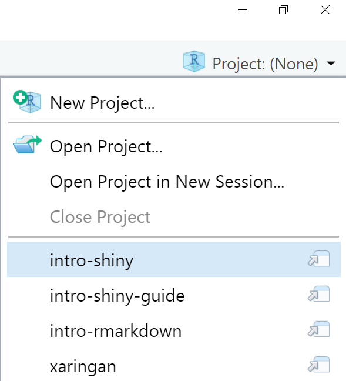
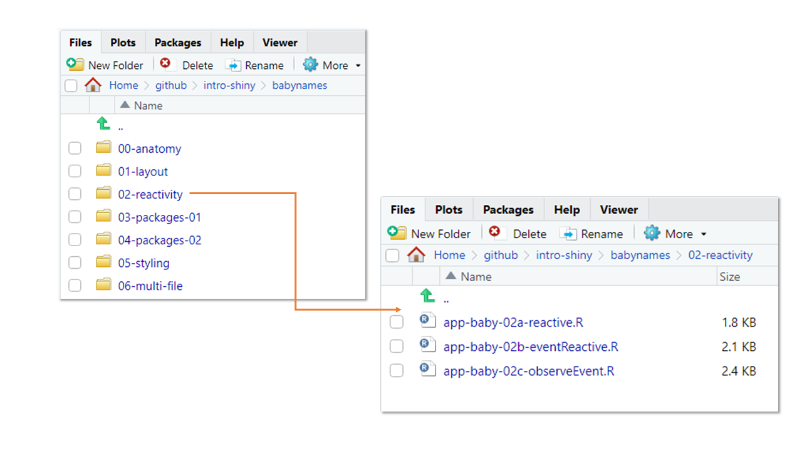

```{r setup, include=FALSE}
knitr::opts_chunk$set(echo = TRUE, eval = FALSE)
```
R and the RStudio IDE are required. See the first module on [R Basics](https://psrc.github.io/r-basics-I/00-index.html) for guidance.

# Session Files on Local Drive

Copy the folder `T:\2021April\intro-shiny` onto a place of your choice on the C drive.

Make sure that the directory of files for the sessions are **copied onto your local drive**. If they are on PSRC's network, you may experience extreme sluggishness when using a `.Rproj` file.

## Open .Rproj

In the RStudio IDE, open the `intro-shiny.Rproj` file. Project files will automatically set our working directory--in this case, the root of the `intro-shiny` directory. No need for `setwd()` and dealing with file paths!



After opening the `.Rproj` file, you'll see some changes to your IDE. Your console and `Files` pane will reflect the new working directory, and the project name is listed in the top right corner.


To close out of the project, click the project name at the top right corner and select `Close Project`. On the day of the session, you can access the dropdown in that area of the IDE and select `intro-shiny`.

<div class="adjacent-image">
<div class="image-left">

</div>
<div>

</div>
</div>

# Install

Install the following packages by running the following code snippet in the console of your RStudio IDE. Ignore any warnings regarding `Rtools` and if you are asked to install from sources which needs compilation, click 'No'. 

<aside>
Some may have already been installed from previous modules. You can adapt the code snippet accordingly.
</aside>

```{r}
install.packages(c("shiny", "shinythemes", "bslib", "DT", "here", "rsconnect", 
                   "tidyverse", "scales", "plotly", "data.table"))
```

# Test

Test to make sure Shiny works by copying and pasting the code snippet into the console of the RStudio IDE.

```{r}
library(shiny)
if (interactive()) {
  shinyApp(
    ui <- fluidPage(
      selectInput("variable", "Variable:",
                  c("Cylinders" = "cyl",
                    "Transmission" = "am",
                    "Gears" = "gear")),
      tableOutput("data")
    ),
    server <- function(input, output) {
      output$data <- renderTable({
        mtcars[, c("mpg", input$variable), drop = FALSE]
      }, rownames = TRUE)
    }
  )
}
```

# Note on Files

The sub-directory `babynames` contains starting and intermediate app files. These files are organized by sections. 

At various points, starting files will be opened and we will add code to them. Starting files include:

- 00-anatomy/app-baby-00.R
- 01-layout/app-baby-01.R
- 04-packages-02/app-baby-04.R

Intermediate files are available in the event that the code-along goes awry. Each intermediate file is a working example of a sub-topic within a section. You can view the code and run it without additional code. The end of a file name for an intermediate file should describe the sub-topic.



# Optional

## Rainbow Parenthesis
<div>
Turn on rainbow parenthesis. There'll be a lot of nested parenthesis and brackets so this is a helpful visual tool to keep track of their counterparts.

`Tools > Global Options > Code > Display`
  
</div>

<aside>
This feature is available in RStudio version 1.4 and above. 
</aside>

## Multiple Source columns
<div>
Activate multiple Source columns (if your screen is wide enough). When working with a multi-page app, having 2 or more files opened side-by-side might be more ergonomic. After adding additional columns, you can open scripts and drag and drop them in either column.

Click on the pane icon . `Pane Layout... > Add Column`  

</div>  

<aside>
This feature is available in RStudio version 1.4 and above. 
</aside>

## shinyapps.io
<div>
Create a free [shinyapps.io](https://www.shinyapps.io/) account. If you want to deploy a project (non-PSRC related and not something with confidential or sensitive data), shinyapps.io  is an option.

Note that deleting an account requires you to contact support@rstudio.com.
</div>    
<aside>
shinyapps.io, an app hosting service by RStudio, offers a free account option, but with limitations.
</aside>
    


