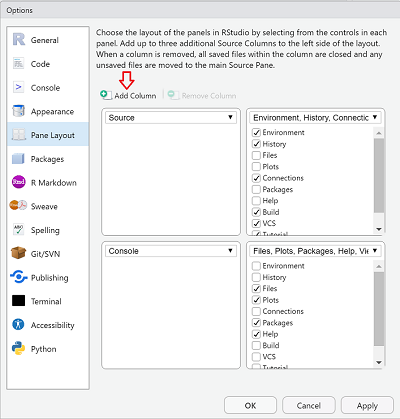

```{r setup, include=FALSE}
knitr::opts_chunk$set(echo = TRUE, eval = FALSE)
```
# Install

R and the RStudio IDE are required. See the first module on [R Basics](https://psrc.github.io/r-basics-I/00-index.html) for guidance.

Install the following packages by running the following code snippet in the console of your RStudio IDE. Ignore any warnings regarding `Rtools` and if you are asked to install from sources which needs compilation, click 'No'. 

<aside>
Some may have already been installed from previous modules. You can adapt the code snippet accordingly.
</aside>

```{r}
install.packages(c("shiny", "shinythemes", "DT", "here", "rsconnect", 
                   "tidyverse", "scales", "plotly", "data.table", "sf", "leaflet"))
```

# Test

Test to make sure Shiny works by copying and pasting the code snippet into the console of the RStudio IDE.

```{r}
library(shiny)
if (interactive()) {
  shinyApp(
    ui <- fluidPage(
      selectInput("variable", "Variable:",
                  c("Cylinders" = "cyl",
                    "Transmission" = "am",
                    "Gears" = "gear")),
      tableOutput("data")
    ),
    server <- function(input, output) {
      output$data <- renderTable({
        mtcars[, c("mpg", input$variable), drop = FALSE]
      }, rownames = TRUE)
    }
  )
}
```

# Optional

## Rainbow Parenthesis
<div>
Turn on rainbow parenthesis. There'll be a lot of nested parenthesis and brackets so this is a helpful visual tool to keep track of their counterparts.

`Tools > Global Options > Code > Display`
  
</div>

<aside>
This feature is available in RStudio version 1.4 and beyond. 
</aside>

## Multiple Source columns
<div>
Activate multiple Source columns. When working with a multi-page app, having at least 2 files opened side-by-side might be more ergonomic. After adding additional columns, you can open scripts and drag and drop them in either column.

Click on the pane icon . `Pane Layout... > Add Column`  

</div>  

<aside>
This feature is available in RStudio version 1.4 and beyond. 
</aside>

## shinyapps.io
<div>
Create a free [shinyapps.io](https://www.shinyapps.io/) account. If you want to deploy a project (non-PSRC related and not something with confidential or sensitive data), shinyapps.io  is an option.

Note that deleting an account requires you to contact support@rstudio.com.
</div>    
<aside>
shinyapps.io, an app hosting service by RStudio, offers a free account option, but with limitations.
</aside>
    


