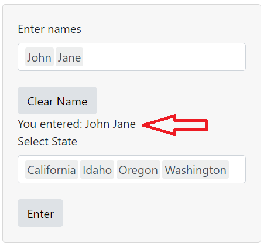
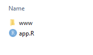
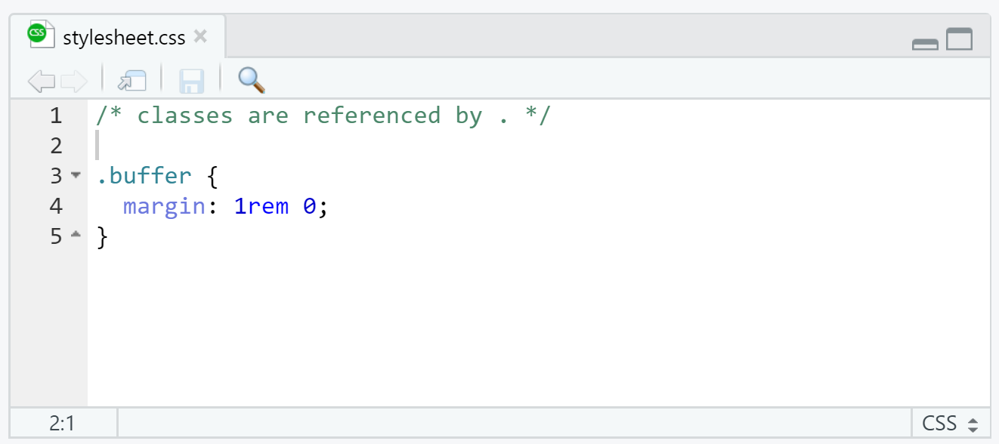

```{r setup, include=FALSE}
knitr::opts_chunk$set(echo = TRUE, eval = FALSE)
```

CSS (Cascading Style Sheets) is a language used for describing the style and layout of a document. You can always use CSS to further customize the appearance of your app, but depending on what you're trying to accomplish, it may not be easy.

```{r, echo=FALSE, eval = TRUE, out.width="80%", fig.cap="We Bare Bears. https://devrant.com/rants/236669/css-in-a-nutshell."}
knitr::include_graphics("https://img.devrant.com/devrant/rant/r_236669_egRwe.gif")
```

<aside>
Working with CSS. Sometimes things don't always happen where we want it to happen.  
</aside>

Part of the difficulty is that by default, Shiny utilizes Bootstrap--a CSS framework, so styles are already in place when we create the UI. To override Bootstrap, try the `shinythemes` or `bslib` package before using CSS.

# `shinythemes`

[shinythemes](https://rstudio.github.io/shinythemes/) is an easy alternative to the default bootstrap theme that is inherent in Shiny. Depending on the theme, it can change fonts, sizing, and color palettes.

```{r}
library(shinythemes)
```

After loading the library, use the theme selector to try out different themes before committing to one.

```{r}
# UI

ui <- fluidPage(
  
  # test different shiny themes with the theme selector
  themeSelector(),

  
  title,
  src,
  .
  .
  .
)
```

Apply one of the shiny themes.

```{r}
# UI

ui <- fluidPage(
  
  # apply a shiny theme
  theme = shinytheme("flatly"),
  
  title,
  src,
  .
  .
  .
)
```

# `bslib`

A recent package, [bslib](https://rstudio.github.io/bslib/index.html), was designed to [make it a little easier](https://rstudio.com/resources/rstudioconf-2020/styling-shiny-apps-with-sass-and-bootstrap-4/) to override Bootstrap settings. Unlike `shinythemes`, fonts and color can be set for different parts of the document.

To find available Google Fonts see: [https://fonts.google.com/](https://fonts.google.com/)

```{r}
library(bslib)
```

```{r}
#UI

ui <- fluidPage(
  
  # use bslib's previewer
  theme = bs_theme() %>% bs_theme_preview(),

  title,
  src,
  .
  .
  .
)
```

After testing, customize your theme by setting the arguments in `bs_theme()`.

```{r}
#UI

ui <- fluidPage(
  
  # set the arguments
  theme = bs_theme(primary = "#FF00F3", 
                   heading_font = font_google("Pacifico"), 
                   spacer = "2rem"),

  title,
  src,
  .
  .
  .
)
  
```

## rem

In Bootstrap 4, rem units of measurement are the default. Unlike pixels, rem is a relative unit of measurement. It can scale relative to the default font size set by the user (on their browser or device). This makes rem units very useful for accessibility[^1].

[^1]: https://www.sitepoint.com/understanding-and-using-rem-units-in-css/

# CSS

There are [several ways to apply custom CSS](https://shiny.rstudio.com/articles/css.html). One is by using a file based CSS. If there are a lot of CSS rules, centralizing it in its own `.css` file can be helpful.

In the example below, we will increase the top and bottom margins around `textOutput('name_entered')`.

```{r, echo=FALSE, eval = TRUE, out.width="50%"}

```

A way to associate a particular CSS rule to an element of your UI is by using a class (a type of [CSS selector](https://developer.mozilla.org/en-US/docs/Web/CSS/CSS_Selectors)). 

<aside>
Learn about different CSS Selectors through a fun game: [CSS Diner](https://flukeout.github.io/)
</aside>

Some R functions will allow an argument for a class name, and others like `textOutput()` doesn't. If so, wrap `div()` around the element and set the class name as an argument.

```{r}
# UI

# apply a class name to the div wrapper
txt_disp <- div(textOutput("name_entered"), class = 'buffer')

```

In the directory where your app file is, create a sub-directory called `www`.

```{r, echo=FALSE, eval = TRUE, out.width="30%"}

```

Create a new text file, with a `.css` extension and save with a file name of your choice inside `www`. 

```{r, echo=FALSE, eval = TRUE, out.width="100%"}

```


```{r}
# CSS

/* classes are referenced by . */
.buffer {
  margin: 1rem 0;
}

```
<aside>
The `margin` CSS property is a shortcut for margin-top, -right, -bottom, -left. 

When only 2 values are provided, the first value is for top & bottom, while the second value is for left & right margins.
</aside>

Back in the UI, reference the newly created CSS file.

```{r}
# UI

ui <- fluidPage(
  
  # link the CSS file to the app
  tags$head(
    tags$link(rel = "stylesheet", type = "text/css", href = "stylesheet.css")
  ),
  .
  .
  .
)

```


